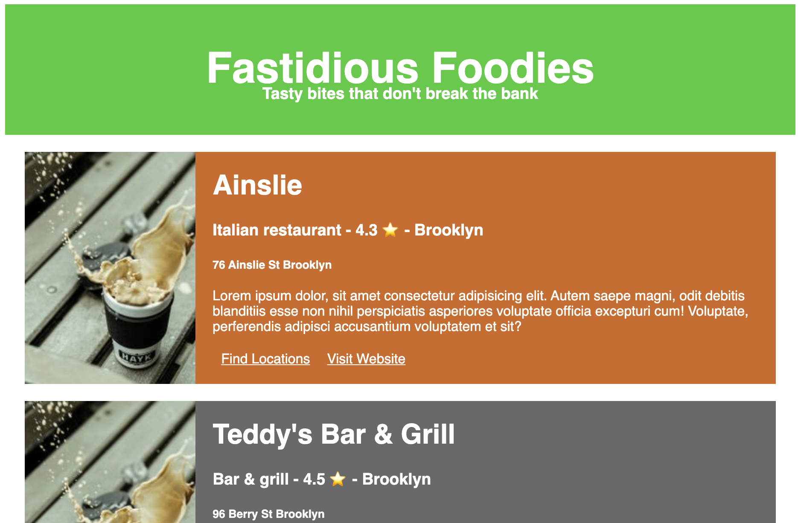

# Intro to Styled Components

## Fastidious Foodies

## Objectives

- Write modular, contained CSS with Styled Components.
- Write conditional styling based on props passed to a styled component.
- Correctly type props within a styled component ruleset.
- Find ways to combine Styled Components with standard CSS selectors to minimize the number of unique styled components you must create.

## Why?

Styled Components strike a balance between several CSS concerns that are often in tension when writing React. Since React combines all the CSS you write into a single document, it can be hard to control the cascade, and the end result is modular HTML in the form of components, but with CSS that isn't quite so modular.

One solution is to be extremely defensive in your naming conventions, as with the [Block - Element - Modifier](http://getbem.com/) methodology. Another is to give every individual item in your React application a totally unique `className` property. Both of these approaches require quite a bit of wraparound work to ensure that all the teams working on CSS for a particular app are very tightly aligned on the conventions of that implementation.

The styled components library allows us to control the cascade while still leveraging it when useful, and let us write real CSS instead of translating each property to a camelCase JS style object. Styled components also allow for some more elegant conditional rendering based on props.

## Framing

You're making a page to display, in brief, some of your favorite restaurants - each one can be classified as bronze, silver, or gold depending on how much you like it.

## Exercises

### 0. Study the App.

In its current state, the app is already fully functional - the point of this exercise isn't to re-learn how to write a React app with TypeScript, but this may be a helpful refresher. Take a moment to examine the types and interfaces that are already established in the `RestaurantCard` component.

Consider especially the pieces of the Restaurant interface that may or may not exist like the "website" property - notice that they're handled conditionally within the body of the card.

Be sure to study the `Hero` component carefully - it has already been configured to use style

### 1. Replace the `div`s in `App.tsx` with styled components.

The `App` component is currently not styled, but the components with corresponding styles are already set up - the `div` elements just need to be replaced with styled components from `App.styles.ts` and the styles should all fall very quickly into place.

### 2. Create styled components for the Restaurant Card.

There's currently no `RestaurantCard.styles.ts` file - you'll need to create one.

Then, refactor all the elements which currently have the following class names into styled components:

- RestaurantCardDiv
- ImageContainer
- CardBody
- CardDescription

Match the conventions in the other two `styles.ts` documents, and reference the [documentation](https://styled-components.com/docs) as necessary.

### 3. Write CSS rules to make cards that look like the example below.

For now, ignore render all the cards a single color. We'll worry about adding in gold, silver, and bronze later.

### 4. Pass the `tier` as a property to the `RestaurantCardDiv` and style conditionally.

A "gold" tier restaurant should have a gold card, a "silver" should have a silver card, and a bronze should have a "bronze" card. You can possibly use `goldenrod`, `silver`, and `peru`.

In order for this to work, you'll need to pass a prop to the styled component, [as modeled in the documentation](https://styled-components.com/docs/basics#passed-props).

You'll also need to be aware that TypeScript presents some additional [requirements for passed properties](https://styled-components.com/docs/api#using-custom-props).
